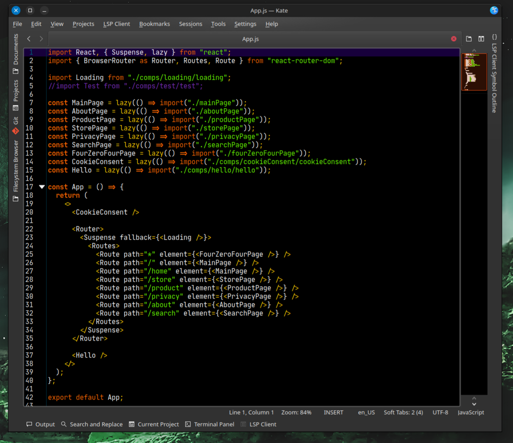

# VIBRANT INKER

"Vibrant Ink" theme for KATE text editor.

I've used Geany theme for reference.  

To install, copy "vibrant_inker.theme" to:

  /home/${user}/.local/share/org.kde.syntax-highlighting/themes/

And/or import theme in "Configure Kate -> Color Themes".

Have fun!

